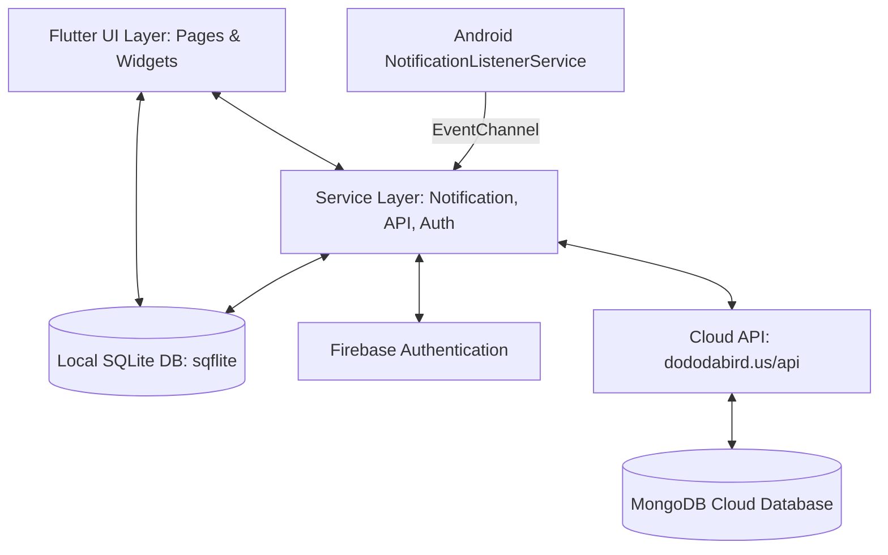
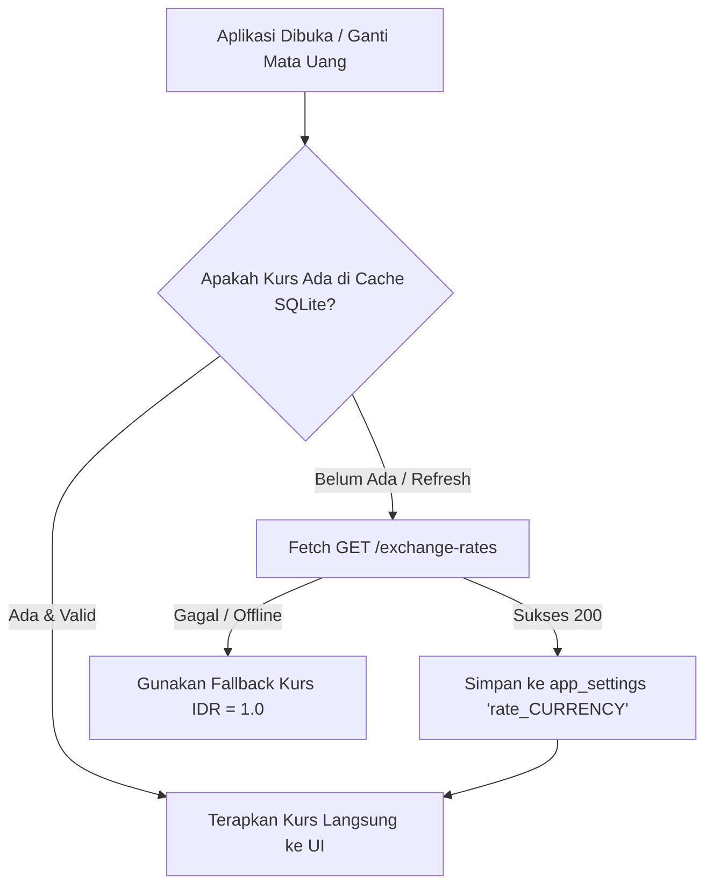
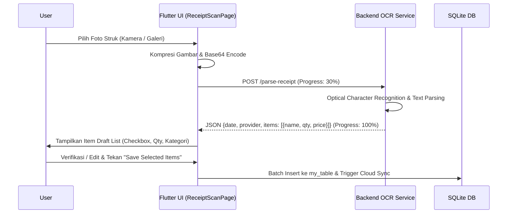
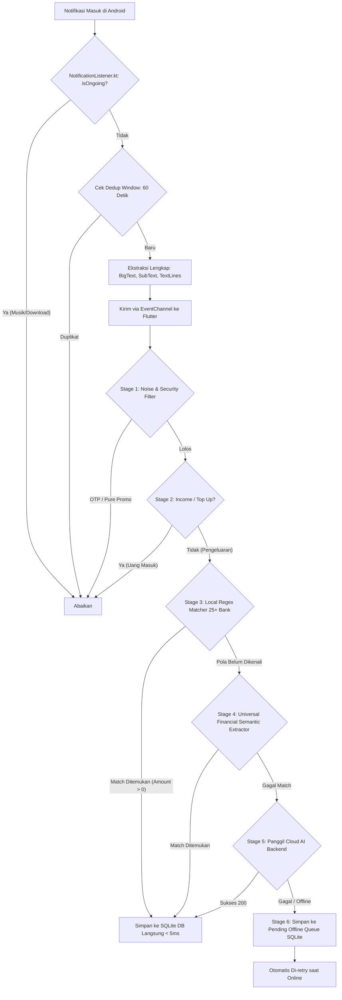

# Dokumentasi Teknis Lengkap: Expense App (Frontend & Native Android)

Dokumen ini memuat spesifikasi arsitektur, daftar seluruh fitur, alur kerja sistem, dan rincian algoritma yang bekerja di balik aplikasi **Expense App** (Personal Finance Tracker).

---

## Daftar Isi
1. [Arsitektur Sistem & Tech Stack](#1-arsitektur-sistem--tech-stack)
2. [Desain UI/UX & Neo-Brutalism Design System](#2-desain-uiux--neo-brutalism-design-system)
3. [Autentikasi & Manajemen Pengguna](#3-autentikasi--manajemen-pengguna)
4. [Sistem Manajemen Pengeluaran (Core CRUD)](#4-sistem-manajemen-pengeluaran-core-crud)
5. [Sistem Multi-Mata Uang & Kurs Real-Time](#5-sistem-multi-mata-uang--kurs-real-time)
6. [Analitik & Dashboard Ringkasan Finansial](#6-analitik--dashboard-ringkasan-finansial)
7. [Smart Receipt Scanner (OCR & AI Parsing)](#7-smart-receipt-scanner-ocr--ai-parsing)
8. [Automated Notification Parser (>99% Robustness Hybrid Engine)](#8-automated-notification-parser-99-robustness-hybrid-engine)
9. [Layar Izin Notifikasi Pertama Kali (First-Time Onboarding)](#9-layar-izin-notifikasi-pertama-kali-first-time-onboarding)
10. [Mesin Sinkronisasi Offline-First & Rekonsiliasi Cloud](#10-mesin-sinkronisasi-offline-first--rekonsiliasi-cloud)
11. [Mesin Ekspor Dokumen Laporan PDF](#11-mesin-ekspor-dokumen-laporan-pdf)
12. [Struktur Database Lokal (SQLite Schema)](#12-struktur-database-lokal-sqlite-schema)
13. [Spesifikasi Lengkap Cloud Backend REST API & Mongoose Schema](#13-spesifikasi-lengkap-cloud-backend-rest-api--mongoose-schema)

---

## 1. Arsitektur Sistem & Tech Stack

Aplikasi ini mengadopsi pola arsitektur **Offline-First Hybrid Mobile Client** dengan sinkronisasi asinkron ke Cloud Backend.



### Komponen Utama:
* **Frontend Framework:** Flutter (Dart SDK ^3.11.0)
* **Local Database:** SQLite via `sqflite` (untuk penyimpanan instan offline & state cache)
* **User Authentication:** Firebase Authentication (Email/Password, Token Refresh)
* **Cloud API & Storage:** Node.js / Express API dengan MongoDB (Cloud Sync, Exchange Rates, Receipt OCR, & AI Parser)
* **Native Android Integration:** Kotlin `NotificationListenerService`, `MethodChannel`, dan `EventChannel`

---

## 2. Desain UI/UX & Neo-Brutalism Design System

Aplikasi menggunakan identitas visual **Neo-Brutalism** modern dengan karakteristik:
* **Border Garis Tebal:** `Border.all(color: Colors.black, width: 2.0 - 2.8)`
* **Hard Drop Shadow (Tanpa Blur):** `BoxShadow(color: Colors.black, offset: Offset(4, 4), blurRadius: 0)`
* **Palet Warna Pastel Kontras:**
  * Cyan Cerah (`#5DF9FF`): Warna primer & status
  * Kuning Lemon (`#F9EB5D` / `#FFD166`): Aksen aksi & kategori makanan
  * Pink Sakura (`#FF99C8`): Kategori pakaian / aksen sekunder
  * Mint Green (`#06D6A0`): Kategori transportasi & konfirmasi aman
  * Lavender Ungu (`#C77DFF`): Kategori school supply
  * Sky Blue (`#70D6FF`): Kategori elektronik
* **Tipografi Unik:** Menggunakan `GoogleFonts.itim` untuk judul, nominal angka, dan label tombol.
* **Micro-Animations (`NeoBouncy`):** Custom widget pembungkus interaksi sentuh yang menghasilkan efek pegas (*spring physics compression*) saat tombol ditekan menggunakan `AnimationController` dan kurva `Curves.easeInOutCubic`.

---

## 3. Autentikasi & Manajemen Pengguna

Diatur oleh [auth_service.dart](file:///c:/Dev/Flutter/Expense_App_Personal/frontend/expenseapp/lib/services/auth_service.dart) dan gerbang rute [auth_gate.dart](file:///c:/Dev/Flutter/Expense_App_Personal/frontend/expenseapp/lib/pages/auth_gate.dart).

### Alur Kerja & Algoritma Autentikasi:
1. **Gerbang Rute Dinamis (`AuthGate`):**
   * Mengamati stream `FirebaseAuth.instance.authStateChanges()`.
   * Jika state berubah menjadi terautentikasi (`hasData`), otomatis me-render `HomePage2()`. Jika logout/null, me-render `AuthPage()`.
2. **Keamanan Multi-Tenant (User Data Isolation):**
   * Setiap record di SQLite memiliki kolom `ownerId` yang diisi `AuthService.currentUser?.uid`.
   * Query database lokal secara otomatis mengunci `WHERE ownerId = ?` sehingga data pengguna satu dengan lainnya di perangkat yang sama tidak akan bercampur.
3. **Penyertaan Token ke Cloud Backend:**
   * Setiap request HTTP ke API backend menyertakan token Firebase di header:
     `Authorization: Bearer <getIdToken()>`.
4. **Re-autentikasi pada Perubahan Kredensial:**
   * Sebelum melakukan perubahan password atau penghapusan akun, sistem memvalidasi password lama melalui `EmailAuthProvider.credential(...)` dan `reauthenticateWithCredential(...)`.

---

## 4. Sistem Manajemen Pengeluaran (Core CRUD)

Pengguna dapat mencatat, melihat, mengubah, dan menghapus pengeluaran harian melalui layar [hp2.dart](file:///c:/Dev/Flutter/Expense_App_Personal/frontend/expenseapp/lib/pages/hp2.dart), [ExpenseAddPage.dart](file:///c:/Dev/Flutter/Expense_App_Personal/frontend/expenseapp/lib/pages/ExpenseAddPage.dart), dan [ExpenseEdit.dart](file:///c:/Dev/Flutter/Expense_App_Personal/frontend/expenseapp/lib/pages/ExpenseEdit.dart).

### Fitur & Algoritma:
1. **Pencatatan Instan (Write-Through):**
   * Saat user menyimpan transaksi:
     ```dart
     insertId = await db.insert('my_table', {... 'synced': 0});
     unawaited(Throw.createExpense(insertId, ...));
     ```
   * Data masuk ke disk lokal dalam waktu `< 3ms` tanpa menunggu koneksi internet selesai, memberikan pengalaman pengguna tanpa *lag*.
2. **Chip Nominal Cepat (*Quick Amount Addition*):**
   * Di `ExpenseAddPage`, tersedia tombol instan `+5k`, `+10k`, `+20k`, `+50k`, `+100k`, `+500k`.
   * **Algoritma Akumulasi:** Menambahkan nilai ke integer yang sudah ada di input controller tanpa merusak format pemisah ribuan.
3. **Pengelompokan Kategori Terstandarisasi:**
   * `makanan`, `transportasi`, `hiburan`, `school supply`, `baju`, `elektronik`, `kesehatan`, `lainnya`.
4. **Klasifikasi Tipe Pengeluaran:**
   * `expected` (Pengeluaran rutin/terencana seperti makan, sewa, bensin).
   * `unexpected` (Pengeluaran tak terduga seperti ban bocor, obat, traktiran mendadak).
   * `others`.

---

## 5. Sistem Multi-Mata Uang & Kurs Real-Time

Mendukung visualisasi pengeluaran dalam berbagai mata uang global (IDR, USD, EUR, GBP, JPY, SGD, AUD, CAD, CNY, KRW).

### Algoritma Konversi & Caching Kurs:


1. **Penyimpanan Nilai Asli (Base Currency IDR):**
   * Semua nominal transaksi di database selalu disimpan dalam bilangan bulat **IDR** (Rupiah).
2. **Kalkulasi Konversi Reaktif:**
   * Nilai yang ditampilkan dihitung *on-the-fly* menggunakan formula:
     $$\text{DisplayAmount} = \text{AmountInIDR} \times \text{ExchangeRate}$$
   * Komponen UI mengamati `ValueNotifier<String> appCurrency` dan `ValueNotifier<double> appExchangeRate`.
3. **Offline Fallback Cache:**
   * Kurs yang didapatkan dari API disimpan ke tabel `app_settings` dengan kunci `rate_<CURRENCY>`, sehingga ketika offline di lain waktu, konversi tetap berfungsi.

---

## 6. Analitik & Dashboard Ringkasan Finansial

Layar [ExpenseSumarry.dart](file:///c:/Dev/Flutter/Expense_App_Personal/frontend/expenseapp/lib/pages/ExpenseSumarry.dart) menyediakan wawasan analitik mendalam atas kebiasaan finansial pengguna.

### Algoritma Komputasi Statistik:
1. **Pecahan Kategori (*Category Breakdown*):**
   * Agregasi total per kategori:
     $$\text{Total}_{\text{cat}} = \sum \text{Amount}_{\text{cat}}$$
   * Persentase proporsi:
     $$\text{Percentage}_{\text{cat}} = \left( \frac{\text{Total}_{\text{cat}}}{\text{Total}_{\text{all}}} \right) \times 100\%$$
   * Diurutkan descending berdasarkan total pengeluaran terbesar.
2. **Rasio Expected vs Unexpected:**
   * Membandingkan total dana yang keluar untuk kebutuhan terencana vs pengeluaran impulsif.
3. **Histogram Pengeluaran Harian (7 Hari Terakhir):**
   * Mengelompokkan transaksi per tanggal kalender untuk 7 hari terakhir:
     ```dart
     for (int i = 6; i >= 0; i--) {
       final day = today.subtract(Duration(days: i));
       final total = expenses.where((e) => isSameDay(e.date, day)).sum();
     }
     ```
   * Menghitung nilai puncak (*peak spending*) untuk normalisasi tinggi bar chart neo-brutalist.
4. **Metrik Finansial Tambahan:**
   * Rata-rata pengeluaran per hari (*Daily Average Burn Rate*).
   * Transaksi tunggal terbesar (*Peak Expense*).
   * Total frekuensi transaksi.

---

## 7. Smart Receipt Scanner (OCR & AI Parsing)

Memungkinkan pengguna memfoto struk belanja kertas (Indomaret, Alfamart, restoran, dsb.) dan mengekstrak seluruh baris item menjadi pengeluaran secara otomatis melalui [ReceiptScanPage.dart](file:///c:/Dev/Flutter/Expense_App_Personal/frontend/expenseapp/lib/pages/ReceiptScanPage.dart).

### Diagram Alur Pemindaian Struk:


### Detail Algoritma:
1. **Pembatalan Operasi (*Cancellable Operation*):**
   * Menggunakan class `ReceiptScanOperation` yang membungkus `http.Client`. Jika pengguna menekan tombol batal di tengah proses unggah/OCR, koneksi HTTP langsung ditutup (`client.close()`) dan memori dibebaskan.
2. **Dukungan Kuantitas Dinamis (*Quantity & Price Multiplier*):**
   * Setiap draft item menyimpan `originalQuantity`, `selectedQuantity`, dan `unitPrice`.
   * Jika pengguna mengubah kuantitas (misal beli 2 kopi tapi hanya ingin mencatat 1):
     $$\text{TotalItemAmount} = \text{unitPrice} \times \text{selectedQuantity}$$

---

## 8. Automated Notification Parser (>99% Robustness Hybrid Engine)

Fitur unggulan yang secara otomatis mendeteksi transaksi perbankan dan e-wallet dari status bar Android, mencatatnya secara instan tanpa perlu membuka aplikasi atau mengetik nominal.

### Arsitektur Multi-Tier Hybrid:


### Rincian Tahapan Algoritma:

#### 1. Layer Native Android ([NotificationListener.kt](file:///c:/Dev/Flutter/Expense_App_Personal/frontend/expenseapp/android/app/src/main/kotlin/com/example/expenseapp/NotificationListener.kt)):
* **Filter Notifikasi Berjalan (`sbn.isOngoing`):** Notifikasi foreground service seperti media player atau unduhan diabaikan.
* **Deduplikasi Native (Signature Caching):** Menghitung signature `packageName_id_postTime` dengan jendela waktu 60 detik untuk mencegah event kembar saat Android memperbarui progress bar notifikasi.
* **Ekstraksi Teks Komprehensif:** Menggabungkan `EXTRA_BIG_TEXT`, `EXTRA_TEXT`, `EXTRA_SUB_TEXT`, dan `EXTRA_TEXT_LINES` (InboxStyle) agar teks struk tidak terpotong.
* **Antrean FIFO JSON Array:** Jika engine Flutter sedang mati/tertutup, notifikasi disimpan dalam `JSONArray` terurut (maksimal 100 antrean) di `SharedPreferences`. Saat aplikasi aktif, antrean di-drain secara berurutan (*First-In, First-Out*).

#### 2. Layer Filter & Smart Context ([local_notification_parser.dart](file:///c:/Dev/Flutter/Expense_App_Personal/frontend/expenseapp/lib/services/local_notification_parser.dart)):
* **Filter Keamanan & OTP:** Kata kunci `otp`, `kode verifikasi`, `password`, `login terdeteksi` langsung diabaikan.
* **Smart Context Promo Filter:** Notifikasi yang memiliki kata `diskon` atau `promo` **tetap diproses** apabila terdeteksi aksi pembayaran valid (contoh: *"Pembayaran QRIS Rp 25.000 berhasil, dapat cashback 10%"*).
* **Filter Transaksi Masuk (*Income Filter*):** Mengabaikan notifikasi "Transfer Masuk" atau "Top Up Berhasil" agar tidak tercatat ganda sebagai beban pengeluaran.

#### 3. Dukungan 25+ Bank & Dompet Digital Indonesia:
Daftar institusi keuangan yang didukung secara *native*:
* **Bank Konvensional & Syariah:** BCA / myBCA, Mandiri Livin', BRImo, BNI / wondr by BNI, Bank Jago, Jenius BTPN, SeaBank, BSI Mobile, BTN Mobile, CIMB OCTO Mobile, PermataME, Danamon D-Bank.
* **E-Wallet & Fintech:** GoPay / Gojek, OVO, DANA, ShopeePay, LinkAja, Grab, Tokopedia, Flip, Kredivo, Akulaku.

#### 4. Universal Financial Semantic Extractor:
Jika notifikasi berasal dari institusi baru atau format berubah:
* **Algoritma Ekstraksi Nominal Fleksibel:**
  Mengenali variasi `Rp 50.000`, `Rp 50.000,00`, `50.000,-`, `IDR 50,000.00`, `50k`, `25rb`, dan `1 250 000`.
* **Ekstraksi Merchant Berbasis Preposisi:**
  Mengekstrak nama merchant setelah kata depan: `di`, `ke`, `to`, `at`, `untuk`.
* **Auto-Kategorisasi Cerdas:**
  Menganalisis nama merchant dengan kamus kata kunci (contoh: *Kopi / Resto / Indomaret* $\rightarrow$ `makanan`, *SPBU / Gojek / KRL* $\rightarrow$ `transportasi`, *Apotek / RS* $\rightarrow$ `kesehatan`, dll).

#### 5. Offline Cloud Retry Queue:
* Jika regex lokal tidak dapat menentukan nama merchant dan panggilan API Cloud AI gagal karena ketiadaan internet, payload notifikasi disimpan ke SQLite (`pending_cloud_notifications`).
* Begitu koneksi pulih, method `retryPendingCloudNotifications()` mengeksekusi antrean secara otomatis sehingga **tingkat keberhasilan parsing mencapai >99% tanpa ada data yang hilang**.

---

## 9. Layar Izin Notifikasi Pertama Kali (First-Time Onboarding)

Diatur oleh [notification_permission_page.dart](file:///c:/Dev/Flutter/Expense_App_Personal/frontend/expenseapp/lib/pages/notification_permission_page.dart) dan dipicu dari [hp2.dart](file:///c:/Dev/Flutter/Expense_App_Personal/frontend/expenseapp/lib/pages/hp2.dart).

### Logika Eksekusi "Hanya Sekali":
1. Saat pengguna pertama kali masuk ke `HomePage2` setelah instalasi, aplikasi menjalankan:
   ```dart
   final shown = await DatabaseHelp.getSetting('notification_permission_onboarding_shown');
   ```
2. Jika bernilai `null` (belum pernah ditampilkan) dan izin Android belum aktif:
   * Aplikasi langsung menulis `'notification_permission_onboarding_shown' = 'true'` ke SQLite.
   * Menampilkan layar `NotificationPermissionPage` dengan transisi halus (`SmoothPageRoute`).
3. **Pilihan Pengguna:**
   * **Tombol "Izinkan Akses Notifikasi":** Mengaktifkan parser (`setParserEnabled(true)`), membuka menu pengaturan sistem Android (`Settings.ACTION_NOTIFICATION_LISTENER_SETTINGS`), dan menutup layar.
   * **Tombol "Nanti Saja":** Menutup layar tanpa membuka pengaturan (fitur tetap dapat diaktifkan kapan saja di tab Pengaturan).
4. Karena flag telah disimpan permanen di database lokal, layar ini dijamin **hanya muncul satu kali saja seumur hidup aplikasi**.

---

## 10. Mesin Sinkronisasi Offline-First & Rekonsiliasi Cloud

Aplikasi dirancang agar dapat digunakan sepenuhnya tanpa internet, dan melakukan rekonsiliasi data secara cerdas saat terhubung ke server backend MongoDB.

### Protokol Sinkronisasi:
1. **Penanda Status (`synced` flag):**
   * `synced = 0`: Transaksi dibuat/diubah secara lokal dan belum tersinkron ke MongoDB.
   * `synced = 1`: Transaksi sudah tersimpan identik di cloud dengan memegang referensi `mongoId`.
2. **Background Push (`syncPendingExpenses`):**
   * Mengambil seluruh baris di `my_table` dengan `synced = 0`.
   * Jika belum memiliki `mongoId`: Memanggil `POST /users` $\rightarrow$ mendapatkan `_id` $\rightarrow$ update `mongoId` & `synced = 1`.
   * Jika sudah memiliki `mongoId`: Memanggil `PUT /users/:id` $\rightarrow$ update data cloud $\rightarrow$ tandai `synced = 1`.
3. **Rekonsiliasi Tarik Data Cloud (`importMissingExpenses`):**
   * Saat user berpindah perangkat atau menginstal ulang, fitur "Load Online Expenses" menarik seluruh data dari backend.
   * **Algoritma Deduplikasi:**
     ```dart
     final localMongoIds = localRows.map((r) => r['mongoId']).toSet();
     for (final online in onlineExpenses) {
       if (!localMongoIds.contains(online['_id'])) {
         // Masukkan hanya transaksi yang belum ada di database lokal
         await db.insert('my_table', ...);
       }
     }
     ```
   * Mencegah terjadinya duplikasi data saat mengimpor dari cloud.

---

## 11. Mesin Ekspor Dokumen Laporan PDF

Memungkinkan pengguna mengunduh riwayat transaksi dalam bentuk dokumen PDF formal yang rapi melalui [hp2.dart](file:///c:/Dev/Flutter/Expense_App_Personal/frontend/expenseapp/lib/pages/hp2.dart).

### Algoritma Pembuatan & Penyimpanan Dokumen:
1. **Penyusunan Format Vektor (`pdf` & `pdf/widgets`):**
   * Menghitung total pengeluaran kumulatif.
   * Menyusun header formal dengan identitas pemilik akun dan stempel waktu ekspor.
   * Menyusun tabel dinamis: Tanggal, Nama Transaksi, Kategori, Tipe, dan Nominal (terformat dalam mata uang aktif).
2. **Penyimpanan Lintas Versi Android:**
   * Di Android modern (Android 10 - 14+), aplikasi menggunakan package `media_store_plus` dan `file_saver` untuk menyimpan file langsung ke folder publik `Download/ExpenseApp` tanpa meminta izin storage berbahaya (*scoped storage compliant*).
3. **Pembukaan File Otomatis:**
   * Memanggil `open_filex` untuk langsung membuka file PDF dengan aplikasi pembaca PDF bawaan ponsel pengguna.

---

## 12. Struktur Database Lokal (SQLite Schema)

Database tersimpan di path aplikasi lokal sebagai `my_db.db` (versi database: 5).

### Tabel: `my_table` (Data Pengeluaran)
| Kolom | Tipe Data | Keterangan |
| :--- | :--- | :--- |
| `id` | INTEGER PRIMARY KEY AUTOINCREMENT | ID transaksi lokal unik |
| `mongoId` | TEXT (Nullable) | ID dokumen ObjectId di MongoDB Cloud |
| `ownerId` | TEXT NOT NULL | Firebase UID pemilik transaksi (Multi-tenant) |
| `name` | TEXT NOT NULL | Nama pengeluaran / Merchant |
| `amount` | INTEGER NOT NULL | Nominal uang dalam mata uang basis IDR |
| `date` | TEXT NOT NULL | Tanggal transaksi format ISO (YYYY-MM-DD) |
| `category` | TEXT NOT NULL | Kategori (`makanan`, `transportasi`, dll) |
| `type` | TEXT NOT NULL | Tipe (`expected`, `unexpected`, `others`) |
| `synced` | INTEGER DEFAULT 0 | Status sinkronisasi (0 = pending, 1 = synced) |

### Tabel: `app_settings` (Konfigurasi & Antrean Persisten)
| Kolom | Tipe Data | Keterangan |
| :--- | :--- | :--- |
| `key` | TEXT PRIMARY KEY | Kunci pengaturan unik |
| `value` | TEXT NOT NULL | Nilai pengaturan (String / JSON Encoded) |

#### Kunci Pengaturan yang Digunakan:
* `theme_mode`: Preferensi tema (`light` / `dark`).
* `currency`: Kode mata uang yang dipilih pengguna (`IDR`, `USD`, `EUR`, dll).
* `rate_<CURRENCY>`: Cache nilai tukar mata uang terhadap IDR.
* `auto_expense_parser`: Status aktif parser notifikasi (`true` / `false`).
* `notification_allowed_apps`: Daftar package name aplikasi yang diizinkan (JSON Array).
* `notification_permission_onboarding_shown`: Flag satu kali tampil layar onboarding izin notifikasi (`true`).
* `pending_cloud_notifications`: Antrean persisten JSON notifikasi offline yang menunggu retry ke Cloud AI.

---

## 13. Spesifikasi Lengkap Cloud Backend REST API & Mongoose Schema

Backend dibangun di atas Node.js & Express 5 yang di-host secara serverless di Vercel, diamankan dengan Cloudflare Edge, dan menggunakan MongoDB Atlas sebagai basis data dokumen cloud.

### Skema Mongoose (`ExpenseSchema`):
```javascript
const ExpenseSchema = new mongoose.Schema(
  {
    ownerId: { type: String, required: true, index: true },
    localId: { type: String, required: true },
    name: { type: String, required: true },
    amount: { type: Number, required: true },
    category: { type: String, required: true },
    type: { type: String, required: true }, // 'expected' | 'unexpected' | 'others'
    date: { type: String, required: true }, // 'YYYY-MM-DD'
  },
  { timestamps: true }
);

// Compound unique index menjamin idempotensi upsert per local ID
ExpenseSchema.index({ ownerId: 1, localId: 1 }, { unique: true });
```

### Matriks Endpoint REST API:

| Method | Path Endpoint | Autentikasi | Fungsi Utama |
| :--- | :--- | :--- | :--- |
| `GET` | `/api/users` | Bearer JWT | Mengambil seluruh transaksi milik pengguna yang terautentikasi |
| `POST` | `/api/users` | Bearer JWT | Membuat atau meng-upsert transaksi baru berdasarkan `localId` |
| `GET` | `/api/users/:id` | Bearer JWT | Mengambil satu transaksi berdasarkan MongoDB ObjectId |
| `PUT` | `/api/users/:id` | Bearer JWT | Memperbarui data transaksi berdasarkan MongoDB ObjectId |
| `DELETE` | `/api/users/:id` | Bearer JWT | Menghapus permanen satu transaksi berdasarkan MongoDB ObjectId |
| `POST` | `/api/users/delete-all` | Bearer JWT | Menghapus massal seluruh transaksi milik pengguna |
| `GET` | `/api/users/local/:localId` | Bearer JWT | Mengambil transaksi berdasarkan identifier lokal SQLite |
| `POST` | `/api/parse-receipt` | Bearer JWT | Upload foto struk base64 & ekstraksi item via Gemini -> OpenRouter GPT-5 Nano -> Azure fallback |
| `POST` | `/api/parse-notification` | Bearer JWT | AI Parsing teks notifikasi Android perbankan menjadi objek transaksi |
| `GET` | `/api/exchange-rates` | Bearer JWT | Mengambil kurs mata uang global real-time (basis IDR) |

---

*Dokumentasi ini disusun untuk mencakup seluruh kapabilitas versi aplikasi saat ini (v1.5.2).*
